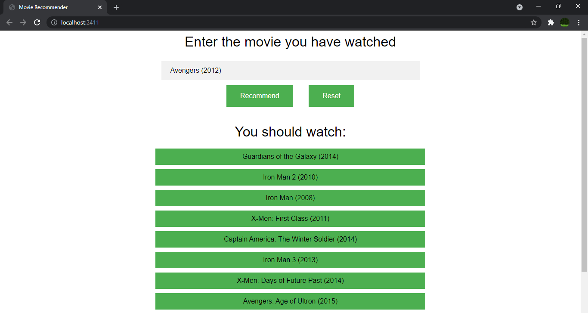

# Recommender-Microservice

The Recommender Microservices uses 4 Micro Services:

1. Data Collector/Pre-Processor
2. Recommender Engine
3. Database
4. Webpage

Screenshot

In case of the error in result, set `git config --global core.autocrlf false` and pull again.
